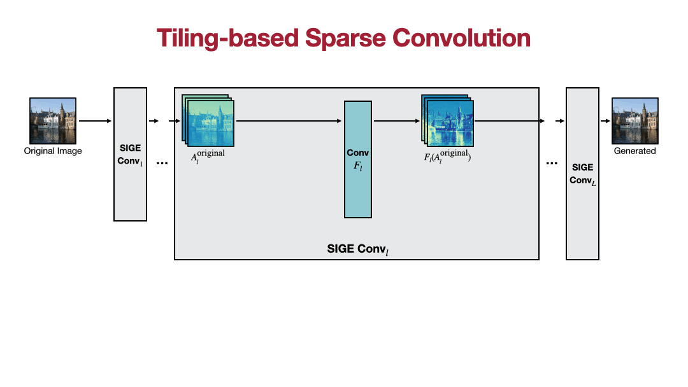
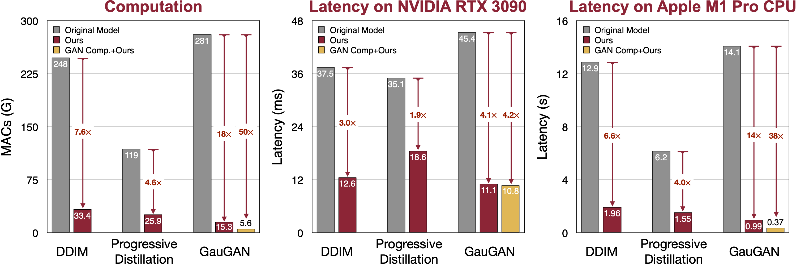

# Spatially Incremental Generative Engine (SIGE)

### [Project](https://www.cs.cmu.edu/~sige/) | Paper| [Videos](https://youtu.be/rDPotGoPPkQ) | [Slides](www.cs.cmu.edu/~sige/resources/slides.key)

**[NEW!]** SIGE  is accepted by NeurIPS 2022! Our code and benchmark datasets are publicly available!


*We introduce Spatially Sparse Inference, a general-purpose method to selectively perform computations at the edited regions for image editing applications. Our method reduces the computation of DDIM by 4~6x and GauGAN by 15x for the above examples while preserving the image quality. When combined with existing compression methods such as GAN Compression, our method further reduces the computation of GauGAN by 47x.*

Efficient Spatially Sparse Inference for Conditional GANs and Diffusion Models</br>
[Muyang Li](https://lmxyy.me/), [Ji Lin](http://linji.me/), [Chenlin Meng](https://cs.stanford.edu/~chenlin/), [Stefano Ermon](https://cs.stanford.edu/~ermon/), [Song Han](https://songhan.mit.edu/), and [Jun-Yan Zhu](https://www.cs.cmu.edu/~junyanz/)</br>
CMU, MIT and Stanford</br>
In NeurIPS 2022. 

## Overview


*Tiling-based sparse convolution overview. For each convolution <i>F<sub>l</sub></i> in the network, we wrap it into SIGE Conv<sub><i>l</i></sub>. The activations of the original image are already pre-computed. When getting the edited image, we first compute a difference mask between the original and edited image and reduce the mask to the active block indices to locate the edited regions. In each SIGE Conv<sub><i>l</i></sub>, we directly gather the active blocks from the edited activation <i>A<sub>l</sub></i><sup>edited</sup> according to the reduced indices, stack the blocks along the batch dimension, and feed them into <i>F<sub>l</sub></i>. The gathered blocks have an overlap of width 2 if <i>F<sub>l</sub></i> is 3×3 convolution. After getting the output blocks from <i>F<sub>l</sub></i>, we scatter them back into <i>F<sub>l</sub></i>(<i>A<sub>l</sub></i><sup>original</sup>) to get the edited output, which approximates <i>F<sub>l</sub></i>(<i>A<sub>l</sub></i><sup>edited</sup>).*

## Performance


*With 1.2% editing, SIGE could reduce the computation of DDIM, Progressive Distillation and GauGAN by 7-18x, achieve 2-4x speedup on NVIDIA RTX 3090 and 4-14x on Apple M1 Pro CPU. When combined with GAN Compression, it further reduces 50x computation on GauGAN, achieving 38x speedup on Apple M1 Pro CPU. Please check our paper for more details and results.*

References:

* Denoising Diffusion Implicit Model (DDIM), Song et al., ICLR 2021
* Progressive Distillation for Fast Sampling of Diffusion Models, Salimans et al., ICLR 2022
* Semantic Image Synthesis with Spatially-Adaptive Normalization (GauGAN), Park et al., CVPR 2019
* GAN Compression: Efficient Architectures for Interactive Conditional GANs, Li et al., CVPR 2020

## Prerequisites

* Python3
* CPU or NVIDIA GPU + CUDA CuDNN
* [PyTorch](https://pytorch.org) >= 1.7

## Getting Started

### Installation

After installing [PyTorch](https://pytorch.org), you should be able to install SIGE with

```shell
pip install git+https://github.com/lmxyy/sige.git
```

or

```shell
git clone git@github.com:lmxyy/sige.git
cd sige
pip install -e .
```

### Usage Example

See [example.py](./example.py) for the minimal SIGE convolution example. Please first install SIGE with the above instructions and [torchprofile](https://github.com/zhijian-liu/torchprofile) with 

```shell
pip install torchprofile
```

Then you can run it with

```shell
python example.py [--use_cuda]
```

We also have [](https://colab.research.google.com/github/mit-han-lab/gan-compression/blob/master/cycle_gan.ipynb) example.

### Benchmark

To benchmark and reproduce the results of [DDIM](https://github.com/ermongroup/ddim) and [Progressive Distillation](https://github.com/google-research/google-research/tree/master/diffusion_distillation) or download the LSUN Church editing datasets, please follow the instructions in [diffusion/README.md](diffusion/README.md).

To benchmark and reproduce the results of [GauGAN](https://github.com/NVlabs/SPADE) and [GAN Compression](https://github.com/mit-han-lab/gan-compression) or download the Cityscapes editing datasets, please follow the instructions in [gaugan/README.md](gaugan/README.md).

## Citation

If you use this code for your research, please cite our paper.
```bibtex
@inproceedings{li2022efficient,
  title={Efficient Spatially Sparse Inference for Conditional GANs and Diffusion Models},
  author={Li, Muyang and Lin, Ji and Meng, Chenlin and Ermon, Stefano and Han, Song and Zhu, Jun-Yan},
  booktitle={NeurIPS},
  year={2022}
}
```

## Acknowledgements

Our code is developed based on [SDEdit](https://github.com/ermongroup/SDEdit), [ddim](https://github.com/ermongroup/ddim), [diffusion_distillation](https://github.com/google-research/google-research/tree/master/diffusion_distillation) and [gan-compression](https://github.com/mit-han-lab/gan-compression). We refer to [sbnet](https://github.com/uber-research/sbnet) for the tiling-based sparse convolution algorithm implementation.

We also thank [torchprofile](https://github.com/zhijian-liu/torchprofile) for MACs measurement, [clean-fid](https://github.com/GaParmar/clean-fid) for FID computation and [drn](https://github.com/fyu/drn) for Cityscapes mIoU computation.

