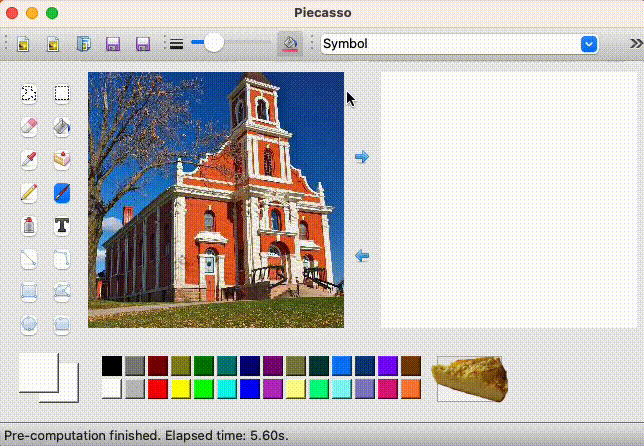

# SIGE Interactive SDEdit Demo


## Overview

<p align="center">
  
</p>

SIGE achieves 2x less conversion time compared to original DDPM on M1 MacBook Pro GPU as we selectively perform computation on the edited regions.

## Prerequisites

* Python3
* CPU, M1 GPU, or NVIDIA GPU + CUDA CuDNN
* [PyTorch](https://pytorch.org) >= 1.7. For M1 GPU support, please install [PyTorch](https://pytorch.org)>=2.0.

**[Notice]** Our code is tested on M1 MacBook Pro with [PyTorch](https://pytorch.org) 2.0. However, it should be runnable on CUDA and CPU machines.

## Getting Started

### Setup

* Install [PyTorch](https://pytorch.org). To reproduce our CUDA and CPU results, please use PyTorch 1.7. To enable MPS backend, please install PyTorch>=2.0.

* Install PyQt5. On M1 MacBook Pro, it can be installed with Conda:

  ```shell
  conda install pyqt
  ```

* Install SIGE following [../README.md](../README.md#installation). Remeber to set the environment variables if you are using M1 GPU.

* Install other dependencies:

  ```shell
  conda install tqdm -c conda-forge
  pip install pyyaml easydict gdown
  ```


### Running

* Original DDPM

  ```shell
  python start.py --config_path configs/church_dpmsolver256-original.yml
  ```

* SIGE DDPM

  ```shell
  python start.py --config_path configs/church_dpmsolver256-sige.yml
  ```

By default, these commands will test results on GPU if GPU is available. You can also explicitly specify the device with `--device`. If the model downloading is too slow for you, you can switch the download source from our website to Google Drive with `--download_tool gdown`.


## Acknowledgement

This frontend is developed based on [Piecasso](https://github.com/learnpyqt/15-minute-apps/tree/master/paint). The backend is developed based on [SDEdit](https://github.com/ermongroup/SDEdit), [ddim](https://github.com/ermongroup/ddim) and [dpm-solver](https://github.com/LuChengTHU/dpm-solver).
